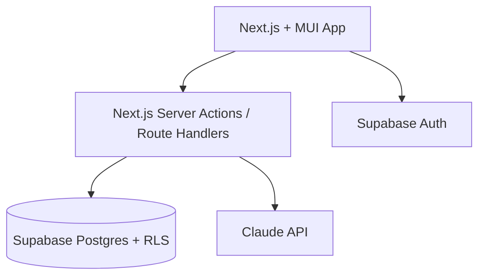
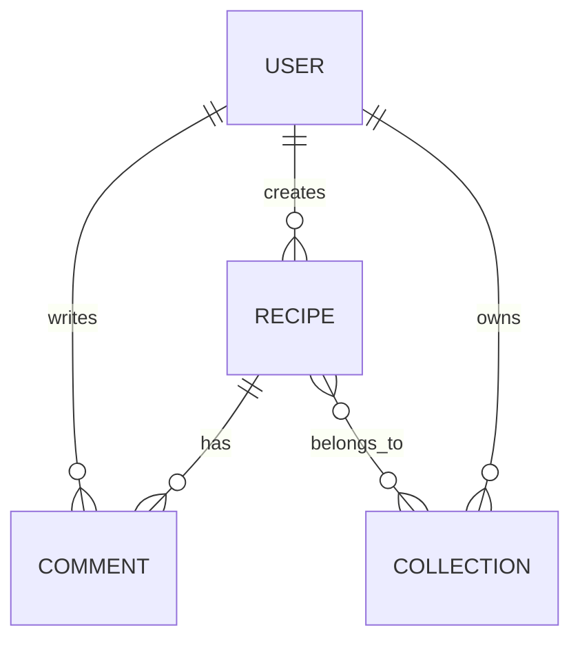
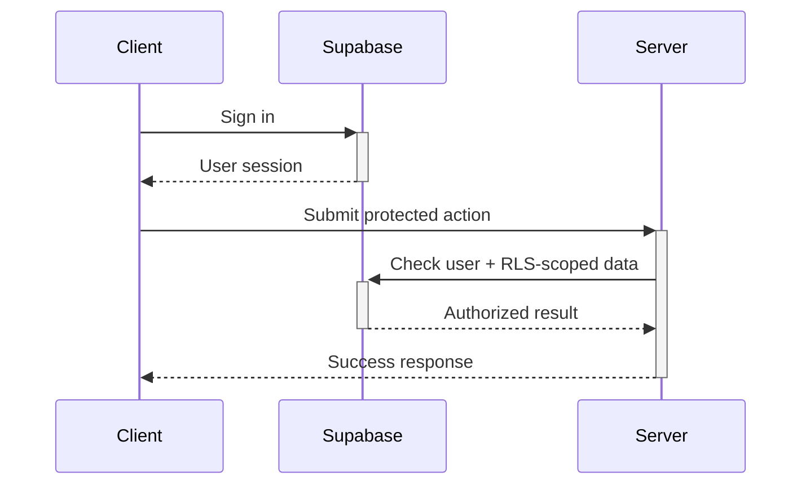
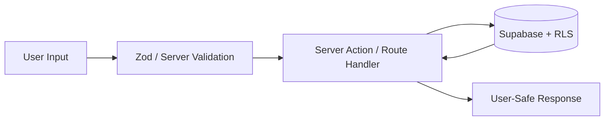
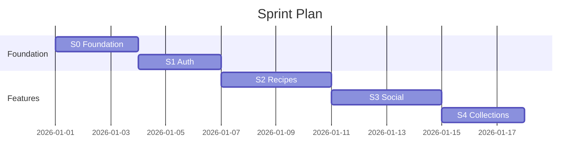

# Mermaid Diagram Rendering Skill

> Reference for any mode that needs to render Mermaid diagrams to PNG/SVG for embedding in PDFs or documents.

---

## Setup

```bash
npm install -g @mermaid-js/mermaid-cli
```

If global install fails, use npx (no install needed):
```bash
npx -y @mermaid-js/mermaid-cli mmdc -i input.mmd -o output.png
```

## Rendering a Diagram

### Step 1: Write the Mermaid code to a `.mmd` file

```bash
cat > /tmp/diagram.mmd << 'EOF'
graph TD
    A[Next.js App] --> B[Server Action / Route Handler]
    B --> C[Supabase Auth]
    B --> D[(Supabase Postgres + RLS)]
    B --> E[Claude API]
EOF
```

### Step 2: Render to PNG

```bash
npx -y @mermaid-js/mermaid-cli mmdc \
  -i /tmp/diagram.mmd \
  -o /tmp/diagram.png \
  -t neutral \
  -b transparent \
  -w 800
```

**Flags:**
- `-t neutral` — clean, professional theme (options: default, dark, forest, neutral)
- `-b transparent` — transparent background (use `white` for PDF embedding)
- `-w 800` — width in pixels
- `-s 2` — scale factor for high-res output

### Step 3: Embed in PDF (reportlab)

```python
from reportlab.platypus import Image
from reportlab.lib.units import inch

# After rendering diagram.mmd → diagram.png
img = Image('/tmp/diagram.png', width=6*inch, height=4*inch)
img.hAlign = 'CENTER'
elements.append(img)
```

## Diagram Types

### System Architecture


### Entity Relationship


### Sequence Diagram


### Data Flow


### Sprint Timeline


## Batch Rendering

When a document has multiple diagrams, render them all at once:

```bash
# Write all diagrams to temp files
for i in 1 2 3; do
  cat > /tmp/diagram_${i}.mmd << EOF
  ... mermaid code ...
EOF
done

# Render all
for f in /tmp/diagram_*.mmd; do
  npx -y @mermaid-js/mermaid-cli mmdc -i "$f" -o "${f%.mmd}.png" -t neutral -b white -w 800
done
```

## Fallback (if mermaid-cli unavailable)

If `npx mmdc` fails (no Node.js, network issues, etc.), convert diagrams to:

1. **ASCII box diagrams** for text output:
```
┌──────────┐     ┌──────────┐     ┌──────────┐
│  Client  │────▶│   API    │────▶│    DB    │
└──────────┘     └──────────┘     └──────────┘
```

2. **Structured tables** for PDFs (using reportlab):
```python
# System architecture as a table
arch_data = [
    ['Component', 'Technology', 'Connects To'],
    ['Frontend', 'Next.js + MUI', 'Server Boundary, Supabase Auth'],
    ['Server Boundary', 'Next.js route handlers/server actions', 'Supabase, Claude'],
    ['Database/Auth', 'Supabase', 'Server Actions / Route Handlers'],
]
```

3. **Description paragraphs** as last resort:
"The Next.js app uses Supabase Auth for sessions. Server actions or route handlers validate input, call Supabase with the user's permissions, and return user-safe responses."

**Never leave raw mermaid code blocks in a PDF.** Always render or convert.

## Best Practices

- Use `neutral` theme for professional documents
- Use `white` background when embedding in PDFs (transparent can cause rendering issues)
- Width 800px is good for full-page diagrams, 600px for half-page
- Scale factor 2 for print-quality output
- Clean up temp files after rendering: `rm /tmp/diagram*.mmd /tmp/diagram*.png`
- Keep diagrams simple — max 15-20 nodes. Split complex systems into multiple diagrams.
