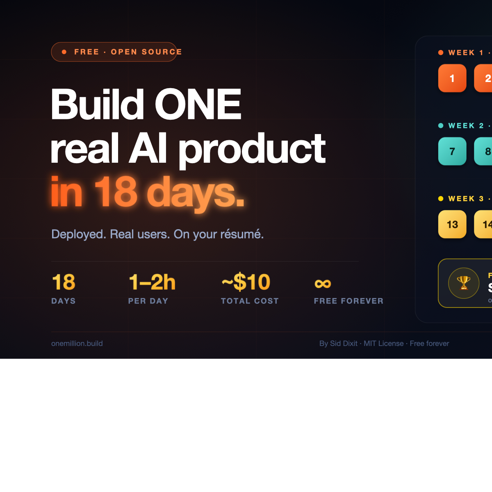

# 🚀 OneMillion: Build a Real AI Product in 18 Days

*Created by [Sid Dixit](https://www.linkedin.com/in/siddharthdixit/)*

---

You've probably seen the posts: solo founders shipping SaaS in a weekend, indie builders launching real AI products from their laptops, people who had never written code now running real businesses. You follow along. Three hours in, you're debugging a system you don't understand.

This course fixes that.

- **18 days, one thing at a time.** No information overload. You build one piece each day and understand it before moving on.
- **1–2 hours per day.** Engineers go faster. EAs go slower. Both finish on Day 18.
- **A real shipped product, no team required.** By Day 18 you have a live URL, real auth, a working AI feature, and real users. Total cost: ~$10 in credits.
- **Use AI to build with AI.** Your AI tool (Claude Code, Cursor, Windsurf — your choice) reads the course files and helps you ship. You direct. You review. You ship.

&nbsp;

## 🎓 Get Certified — Become a Builder

Complete all 18 days and pass all 18 verifications → earn **Builder #N**. Sequential, permanent, public. Listed forever at [onemillion.build/builders](builders/README.md).

🎁 First 100 builders ever get **Founding Builder** status: permanent badge + Sid's personal Slack + intro to one investor or hiring manager on graduation.

Apply for the next cohort: [cohort/README.md](cohort/README.md)

---

## 💡 How It Works

- **Five files per day.** `learn.md` is the concept. `build.md` is the hands-on guide. `ai-instructions-day-XX.md` is a prompt you paste into your AI — it reads your work, runs the checks, and tells you if you passed. `loom.md` is Sid walking through it. `resources.md` is for going deeper.
- **Read the learn, follow the build, run the verifier.** Pass all 18 verifiers → claim your Builder number.
- **Your AI builds with you.** Each build includes prompts you paste into Claude Code (or any AI tool). It writes the code. You direct, review, and ship.
- **Transferable.** The framework — spec before code, multi-agent decomposition, validation gates, production hygiene, human review loop — applies to every product you build after this.

---

## 📚 Course Days

| Day | What You Build |
|-----|----------------|
| [Day 0: Public Commitment](day-0-commit/README.md) | A LinkedIn post that doubles your odds of finishing |
| [Day 1: Vision + Mental Map](week-1-foundation/day-01-vision/learn.md) | A picked product idea + the mental model for how AI products work |
| [Day 2: Problem + Mom Test](week-1-foundation/day-02-problem/learn.md) | 3 real conversations + validated pain before you write a line of code |
| [Day 3: Write Your PRD](week-1-foundation/day-03-prd/learn.md) | Locked PRD — 5 sections, exactly 3 features, scope frozen |
| [Day 4: Stack + First Deploy](week-1-foundation/day-04-stack/learn.md) | A real Next.js app live at your-app.vercel.app |
| [Day 5: Auth + Database](week-1-foundation/day-05-auth/learn.md) | Signup → login → logout with Row Level Security |
| [Day 6: Core Feature](week-1-foundation/day-06-core-feature/learn.md) | Your main feature working end-to-end |
| [Day 7: AI Feature Spec](week-2-make-it-ai/day-07-ai-spec/learn.md) | Locked AI spec with measurable quality criteria |
| [Day 8: First AI Call](week-2-make-it-ai/day-08-first-ai-call/learn.md) | Real Claude output flowing into your app |
| [Day 9: Streaming UI](week-2-make-it-ai/day-09-streaming/learn.md) | Text appearing token by token in your UI |
| [Day 10: Tool Use](week-2-make-it-ai/day-10-tool-use/learn.md) | AI reading and acting on your database |
| [Day 11: RAG](week-2-make-it-ai/day-11-rag/learn.md) | AI personalized to each user's actual data |
| [Day 12: Lock the AI](week-2-make-it-ai/day-12-lock-the-ai/learn.md) | Acceptance tests + cost budget + rate limits |
| [Day 13: Production Hygiene](week-3-ship-and-sell/day-13-hygiene/learn.md) | 9-point audit — secrets, RLS, error handling |
| [Day 14: Custom Domain](week-3-ship-and-sell/day-14-domain/learn.md) | yourapp.com live with SSL |
| [Day 15: Monitoring](week-3-ship-and-sell/day-15-monitoring/learn.md) | Sentry + Vercel Analytics + UptimeRobot live |
| [Day 16: Landing Page](week-3-ship-and-sell/day-16-landing/learn.md) | Hero → Problem → Solution → Proof → CTA |
| [Day 17: First 10 Users](week-3-ship-and-sell/day-17-first-users/learn.md) | At least 1 real user with documented feedback |
| [Day 18: Demo Day → Builder #N](week-3-ship-and-sell/day-18-demo/learn.md) | 5-min Loom + your permanent Builder number |

---

## 🏆 What You Walk Away With

- **A live SaaS at yourapp.com** — a real product, not a tutorial project
- **A GitHub repo** with 18 days of commits — proof you built it yourself
- **Builder #N** — sequential, permanent, public
- **A public profile** at onemillion.build/builders/[your-number]
- **The ability to build any product, from scratch, for the rest of your life**

---

## 🚀 Who This Course Is For

- **Executive assistants** who've never opened a terminal
- **Product managers** who've written specs but never built the product
- **Engineers** who want to master agentic SDLC and the modern way of building
- **Anyone** — yoga teachers, nurses, designers, retirees, career-changers

Zero prior experience required. If you can use Google Docs, you can do this.

---

## 🛠️ What You Need to Start

- A laptop (Mac or Windows)
- An Anthropic API key ([here's how to get one](getting-your-api-key.md)) — ~$10 in credits covers the full course
- An AI tool of your choice — Claude Code, Cursor, Windsurf, or any AI chat ([pick yours](tools/README.md))

Total setup: ~30 minutes. Start here: [getting-started.md](getting-started.md)

---

## 🗓️ Live Cohorts

Sid runs free weekend cohorts every 6–8 weeks. Saturday live session + 1 hr/day self-paced. Demo Day on the final Saturday.

→ Apply for the next cohort: [cohort/README.md](cohort/README.md)

🎁 First 100 builders ever earn permanent **Founding Builder** status.

---

## ❓ FAQ

Have questions about cost, technical requirements, which AI tool to use, or what happens if you fall behind? [Read the FAQ](FAQ.md).

---

## 🔗 Related

- [The Manifesto: The Age of Agentic Engineering](MANIFESTO.md)
- [Cost Transparency](cost-transparency.md) — full breakdown of what 18 days costs
- [Best OneMillion Resources](best-onemillion-resources.md) — after-course exploration
- [How Builder #N is earned](verify/README.md)

---

## 💬 Share the Love

Finished the course? Tag [Sid Dixit](https://www.linkedin.com/in/siddharthdixit/) on LinkedIn with **#BuildingWith1M** and tell him what you built. It makes his day — and helps the next builder find the course.

---

## 📄 License

MIT. Free to use, fork, remix, and share. If you build on this, credit OneMillion and link back to this repo.

---

**Happy building. 🚀**

→ **[Start with Day 0](day-0-commit/README.md)**
