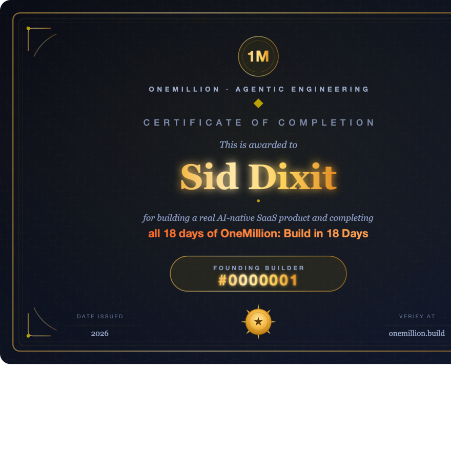

# 🚀 OneMillion: Build a Real AI Product in 18 Days

*Created by [Sid Dixit](https://www.linkedin.com/in/siddharthdixit/)*

  <strong>Claude Code-first</strong> &bull;
  <strong>18 daily builds</strong> &bull;
  <strong>Beginner-friendly</strong> &bull;
  <strong>Ship a real AI product</strong>

  <a href="START-HERE.md">Start Here</a> &bull;
  <a href="#-course-days">Course Days</a> &bull;
  <a href="verify/README.md">Verification</a> &bull;
  <a href="FAQ.md">FAQ</a> &bull;
  <a href="../builders/README.md">Builder Wall</a>

---

You've seen the posts. Solo founders shipping SaaS in a weekend. Indie builders launching real AI products from their laptops. People who had never written code running real businesses. You follow along. Three hours in, you're debugging a system you don't understand, wondering if this is actually for you.

**It is. And this is how.**

- **18 days, one product at a time.** No information overload. You make one meaningful move each day and understand it before moving on.
- **1–2 hours per day.** Short enough to fit around work, family, and the rest of real life.
- **A deployed product, not a sandbox.** By the end, you have a live URL, working AI features, documented feedback from at least one real person, and a launch plan.
- **Use AI to learn how to build with AI.** The course is designed around agents that help you spec, design, build, verify, secure, deploy, and sell.
- **Free forever.** Course content is MIT licensed. No bootcamp fee. No paywalled advanced tier.

---

## ✨ What Is OneMillion Builders?

**OneMillion is on a mission to take one million people — anyone with an idea — from zero to a real, deployed, launchable product in 18 days.**

Not a tutorial. Not a sandbox. A real product, on a real server, ready for real users.

We do this by giving you a set of AI agents that work alongside you through every step:

- 🧭 **Define** — capture your idea and write a clear product requirements document
- 🏗️ **Architect** — design the software so it's built to last, not just to ship
- 🗓️ **Plan** — break the build into day-by-day steps you can actually execute
- ⚒️ **Build** — write the code, review it, and ship it — with AI doing the heavy lifting
- 🔐 **Secure** — run automated security checks before anything goes live
- 🚢 **Deploy** — get your product onto a real web server or cloud in minutes
- 📣 **Sell** — build a go-to-market plan: how to launch, market, and evangelize your product

**No prior coding knowledge required.** The agents guide you through every decision. If you've never written a line of code, the path is built for you. If you're an engineer, you blaze through and go deeper.

By the end, you have a live URL, working AI features, documented feedback from at least one real person, and a launch plan. Total AI cost: usually $5–15 in Anthropic credits; optional domains are covered in the Day 14 guide.

→ **Start here:** [Start Here](START-HERE.md) 
→ Already set up? [Begin Day 0](day-0-commit/README.md) 
→ Returning after a break? [Recover your place](recover.md)

---

## 🗺️ Course Map

| Stage | Days | Outcome | Start |
|-------|------|---------|-------|
| 🧱 **Foundation** | 1-6 | Deployed web app with auth, database, and one core feature | [Week 1](week-1-foundation/README.md) |
| 🧠 **Make It AI** | 7-12 | Real Claude-powered feature with streaming, tools, RAG, and quality gates | [Week 2](week-2-make-it-ai/README.md) |
| 🚢 **Ship & Sell** | 13-18 | Production hygiene, landing page, outreach, demo, and Builder Claim | [Week 3](week-3-ship-and-sell/README.md) |

Each day has the same rhythm: **learn → build → verify → update progress**.

---

## 🎓 Get Certified — Become a Builder

Complete all 18 days, pass final verification, and submit your Builder Claim. Once accepted, you earn **Builder #N**: sequential, permanent, public, and listed forever at [onemillion.build/builders](../builders/README.md).

Each day has an AI verification prompt. Day 18 requires your daily verification reports, a public repo, a deployed URL, a Loom demo, and final anti-cheating checks. See [How Builder #N is earned](verify/README.md).

First 100 builders ever get **Founding Builder** status: permanent badge + Sid's personal Slack + intro to one investor or hiring manager on graduation.

Apply for the next cohort: [cohort/README.md](../cohort/README.md)

---

## 💡 How It Works

You don't need to know how to code. If you do — great, you'll go faster. Either way, you finish.

Here's the journey: over 18 days, you become a **lean, AI-powered builder** — someone who can take an idea from a napkin concept to a production-shaped product deployed on the cloud. Not a toy tutorial. A working application — an AI agent, a web app, or a hybrid of both — that is ready for first users and real feedback.

You can do OneMillion two ways:

- 🧑‍💻 **Self-paced.** Follow the 18 days in this repo on your own schedule.
- 🧑‍🤝‍🧑 **Live cohort.** Join a free group when applications are open.

The same curriculum and verifiers apply either way.

**Every day follows the same rhythm:**

- 📖 **Learn.** Read a short concept that builds your mental model.
- 🛠️ **Build.** Follow a hands-on guide where Claude Code does the heavy lifting. You direct. You review. You ship.
- ✅ **Verify.** Paste a prompt into Claude Code. It checks your work and tells you what passed, what failed, and what to fix.

**Support is built in:**

- 🎥 **Video walkthroughs** — Sid walks through the course so you have a human reference
- 🗓️ **Weekly live sessions** — group calls to unblock, answer questions, and keep you moving
- 💬 **Slack community** — a dedicated channel where builders help each other in real time
- 🧑‍🏫 **Mentors on call** — real people who've been through the build, ready to answer when you're stuck

The only thing you need to bring is the will to keep going. If you show up, we show up: walkthroughs, community support, office hours, and mentors are designed to keep you moving when you get stuck.

**What you need to start:**

- 💻 A laptop (Mac or Windows)
- 🔑 An [Anthropic account](getting-your-api-key.md) — most builders spend $5–15 in AI credits
- ⏱️ 1–2 hours a day

**What you keep forever:**

When you graduate, the AI agents you built with don't go away. They stay in your toolkit — ready to help you spec, design, build, test, secure, deploy, and sell the next product. And the one after that. **You've learned how to wield AI. That skill compounds for life.**

---

## 🧩 See What You Produce

- 🪪 **A Day 18-style credential** — [sample Builder profile](diagrams/builder-profile-sample.png)
- 📁 **A golden-path example** — [DeliverableDash artifacts](examples/deliverabledash/README.md)
- 🖥️ **A sample finished app shape** — [DeliverableDash app mock](examples/deliverabledash/app/README.md)
- ✅ **The verification workflow** — [how Builder #N is earned](verify/README.md)
- 🎬 **A public launch artifact** — [Day 18 demo requirements](week-3-ship-and-sell/day-18-demo/learn.md)
- 🔑 **The AI credit setup** — [Getting Your API Key](getting-your-api-key.md)
- 📣 **Public milestone posts** — [Share Templates](share-templates.md)

---

## 📚 Course Days

| Day | What You Build |
|-----|----------------|
| [Day 0: Public Commitment](day-0-commit/README.md) | A LinkedIn post that doubles your odds of finishing |
| [Day 1: Vision + Mental Map](week-1-foundation/day-01-vision/learn.md) | A picked product idea + the mental model for how AI products work |
| [Day 2: Problem + Mom Test](week-1-foundation/day-02-problem/learn.md) | 3 real conversations + validated pain before you write a line of code |
| [Day 3: Write Your PRD](week-1-foundation/day-03-prd/learn.md) | Locked PRD — 5 sections, exactly 3 features, scope frozen |
| [Day 4: Stack + First Deploy](week-1-foundation/day-04-stack/learn.md) | A real Next.js app live at your-app.vercel.app |
| [Day 5: Auth + Database](week-1-foundation/day-05-auth/learn.md) | Signup → login → logout with Row Level Security |
| [Day 6: Core Feature](week-1-foundation/day-06-core-feature/learn.md) | Your main feature working end-to-end |
| [Day 7: AI Feature Spec](week-2-make-it-ai/day-07-ai-spec/learn.md) | Locked AI spec with measurable quality criteria |
| [Day 8: First AI Call](week-2-make-it-ai/day-08-first-ai-call/learn.md) | Real Claude output flowing into your app |
| [Day 9: Streaming UI](week-2-make-it-ai/day-09-streaming/learn.md) | Text appearing token by token in your UI |
| [Day 10: Tool Use](week-2-make-it-ai/day-10-tool-use/learn.md) | AI reading and acting on your database |
| [Day 11: RAG](week-2-make-it-ai/day-11-rag/learn.md) | AI personalized to each user's actual data |
| [Day 12: Lock the AI](week-2-make-it-ai/day-12-lock-the-ai/learn.md) | Acceptance tests + cost budget + rate limits |
| [Day 13: Production Hygiene](week-3-ship-and-sell/day-13-hygiene/learn.md) | 9-point audit — secrets, RLS, error handling |
| [Day 14: Custom Domain](week-3-ship-and-sell/day-14-domain/learn.md) | Optional custom domain with SSL, or a documented decision to stay on Vercel |
| [Day 15: Monitoring](week-3-ship-and-sell/day-15-monitoring/learn.md) | Sentry + Vercel Analytics + UptimeRobot live |
| [Day 16: Landing Page](week-3-ship-and-sell/day-16-landing/learn.md) | Hero → Problem → Solution → Proof → CTA |
| [Day 17: First 10 Users](week-3-ship-and-sell/day-17-first-users/learn.md) | At least 1 real user with documented feedback |
| [Day 18: Demo Day → Builder Claim](week-3-ship-and-sell/day-18-demo/learn.md) | 5-min Loom + final verification + Builder Claim submission |

---

## 🏆 What You Walk Away With

- 🌐 **A deployed product** — live on Vercel, with an optional custom domain
- 📦 **A GitHub repo** with 18 days of commits — proof you built it yourself
- 🎓 **Builder #N after review** — sequential, permanent, public
- 🪪 **A public profile** at onemillion.build/builders/[your-number] after your claim is accepted
- 🔁 **A repeatable way to spec, build, verify, and ship your next product**

---

## 🚀 Who This Course Is For

- 🗂️ **Executive assistants** who've never opened a terminal
- 🧠 **Product managers** who've written specs but never built the product
- 👩‍💻 **Engineers** who want to master agentic SDLC and the modern way of building
- 🌎 **Anyone** — yoga teachers, nurses, designers, retirees, career-changers

Zero prior experience required. If you can follow step-by-step instructions, copy commands carefully, and ask AI for help when something breaks, you can do this.

---

## 🛠️ What You Need to Start

- 💻 A laptop (Mac or Windows)
- 🔑 An Anthropic API key ([here's how to get one](getting-your-api-key.md)) — most builders spend $5–15 in AI credits
- 🤖 Claude Code — the supported AI builder for this version of the course. [Getting Started](getting-started.md) walks you through setup.

Total setup: 15-60 minutes depending on your path. Start here: [START-HERE.md](START-HERE.md)

---

## 🗓️ Live Cohorts

Sid runs free weekend cohorts every 6–8 weeks. Saturday live session + 1 hr/day self-paced. Demo Day on the final Saturday.

→ Apply for the next cohort: [cohort/README.md](../cohort/README.md)

First 100 builders ever earn permanent **Founding Builder** status.

---

## ❓ FAQ

Have questions about cost, technical requirements, Claude Code setup, or what happens if you fall behind? [Read the FAQ](FAQ.md).

---

## 🔗 Related

- [The Manifesto: The Age of Agentic Engineering](../MANIFESTO.md)
- [Getting Your API Key](getting-your-api-key.md) — AI credit setup and cost guidance
- [Best OneMillion Resources](best-onemillion-resources.md) — after-course exploration
- [How Builder #N is earned](verify/README.md)

---

## 💬 Share the Love

Finished the course? Tag [Sid Dixit](https://www.linkedin.com/in/siddharthdixit/) on LinkedIn with **#BuildingWith1M** and tell him what you built. It makes his day — and helps the next builder find the course.

---

## 📄 License

MIT. Free to use, fork, remix, and share. If you build on this, credit OneMillion and link back to this repo.

---

🚀 **[Start Here](START-HERE.md)** 
✅ Already set up? **[Begin Day 0](day-0-commit/README.md)**
