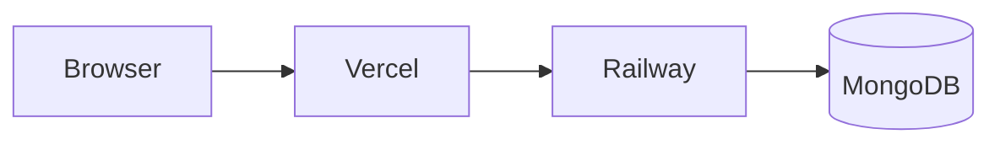
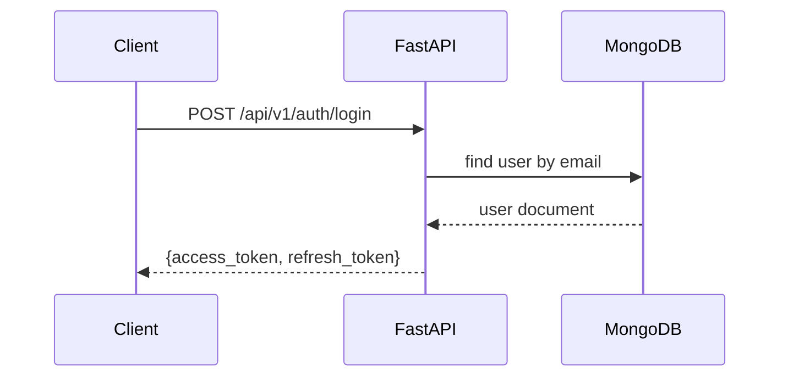
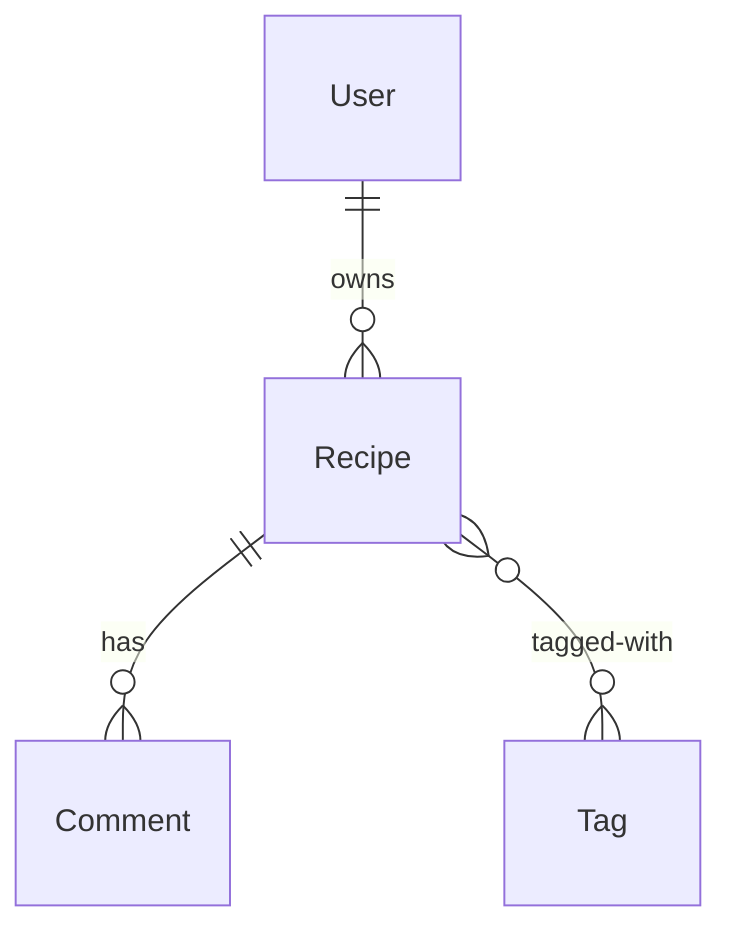
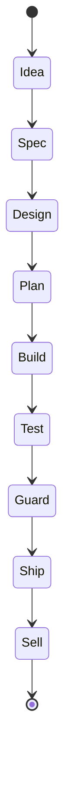

# Mermaid Diagram Skill

Generate Mermaid diagrams and render them to PNG using mermaid-cli.

## Install

```bash
npm install -g @mermaid-js/mermaid-cli
```

## Render to PNG

```bash
# Write diagram to temp file
cat > /tmp/diagram.mmd << 'EOF'
[mermaid content]
EOF

# Render
npx mmdc -i /tmp/diagram.mmd -o /tmp/diagram.png -t neutral -b transparent
```

## Diagram Types

### System Architecture


### Data Flow


### Entity Relationship


### State Machine


## In PDF Reports

If mermaid-cli is unavailable, convert diagrams to ASCII box diagrams or structured tables. Never leave raw mermaid code in PDF files.
